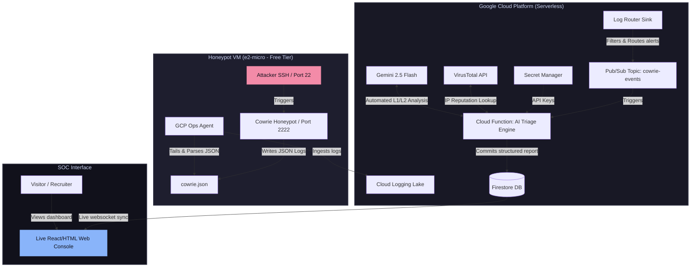

# Cloud-Native AI SOC Analyst (L1/L2 Automation Pipeline)

An automated, 100% serverless security operations pipeline built on **Google Cloud Platform (GCP)**. This project captures real attacker telemetry via a Cowrie SSH Honeypot, streams event logs to a cloud-native SIEM (Cloud Logging), and orchestrates an automated L1/L2 triage engine using **Gemini 2.5 Flash** and **VirusTotal** threat intelligence. Triaged incidents are committed in real-time to a Firestore database and streamed to a live glassmorphic dashboard.

Designed to fit entirely within the **Google Cloud Always Free Tier**, this architecture eliminates the resource and cost overhead of running heavy VM-based SIEM nodes (like Wazuh or Splunk) while demonstrating production-grade SecOps automation.

---

## 🏗️ Architecture Overview



---

## ⚡ The Security Automation Workflow

1. **Intrusion Attempt**: An attacker attempts an SSH brute-force or logs in and executes commands on port `22` of the honeypot VM.
2. **Telemetry Capture**: The Cowrie honeypot records the connection parameters (IP, country, timestamps, tried credentials, shell input) and writes them as JSON to disk.
3. **Log Shipping**: The Google Cloud Ops Agent detects the new lines in the log, parses the JSON structure, and streams it to Google Cloud Logging.
4. **Event Routing**: A Google Cloud Log Router Sink captures these logs matching `logs/cowrie_log` and publishes them to a Google Cloud Pub/Sub topic.
5. **AI Enrichment & Triage**:
   - The Pub/Sub event triggers our Cloud Function.
   - The function queries the **VirusTotal API** using the attacker's source IP to assess global threat reputation.
   - The function structures a JSON context block including the honeypot session data and the VirusTotal reputation, then prompts **Gemini 2.5 Flash**.
   - Gemini classifies severity (LOW, MEDIUM, HIGH, CRITICAL), maps the attacker's actions to MITRE ATT&CK techniques, writes a natural language summary, and drafts response recommendations.
6. **Persistence**: The full report is stored as a document in a native Google Cloud Firestore database.
7. **Live Streaming**: The web console (hosted on Firebase Hosting) listens to Firestore via websockets, immediately updating the graphs and scrolling feed without requiring a page refresh.

---

## 🛠️ Step-by-Step Deployment Guide

### Phase 1: Setup GCP Project & Secrets

1. Create a new Google Cloud project in the [GCP Console](https://console.cloud.google.com/). Ensure billing is enabled (required to configure Cloud Functions, but remains in the free tier bounds).
2. Set up a **GCP Billing Alert** for $1.00 as a safety rail.
3. Enable the required APIs:
   ```bash
   gcloud services enable compute.googleapis.com \
                          pubsub.googleapis.com \
                          logging.googleapis.com \
                          secretmanager.googleapis.com \
                          firestore.googleapis.com \
                          cloudfunctions.googleapis.com \
                          run.googleapis.com
   ```
4. Obtain free API keys:
   - **VirusTotal API Key**: Sign up on [VirusTotal](https://www.virustotal.com/) and copy your public API key.
   - **Gemini API Key**: Sign up on [Google AI Studio](https://aistudio.google.com/) and retrieve a Developer API key.

### Phase 2: Provision Infrastructure with Terraform

1. Move to the Terraform directory:
   ```bash
   cd infra/terraform
   ```
2. Create a `terraform.tfvars` file:
   ```hcl
   project_id = "your-gcp-project-id"
   region     = "us-central1"
   zone       = "us-central1-a"
   ```
3. Initialize and deploy:
   ```bash
   terraform init
   terraform apply
   ```
4. Put your API keys into Secret Manager via GCP Console or CLI:
   ```bash
   echo -n "YOUR_VIRUSTOTAL_KEY" | gcloud secrets versions add virustotal-api-key --data-file=-
   echo -n "YOUR_GEMINI_KEY" | gcloud secrets versions add gemini-api-key --data-file=-
   ```

### Phase 3: Deploy the Cloud Function

1. Navigate to the triage-engine code:
   ```bash
   cd ../../triage-engine
   ```
2. Deploy the Python Cloud Function triggered by Pub/Sub, passing in secrets as environment variables:
   ```bash
   gcloud functions deploy triage-pubsub-event \
     --gen2 \
     --runtime=python310 \
     --region=us-central1 \
     --entry-point=triage_pubsub_event \
     --trigger-topic=cowrie-events \
     --service-account=triage-function-sa@YOUR_PROJECT_ID.iam.gserviceaccount.com \
     --set-secrets="VIRUSTOTAL_API_KEY=virustotal-api-key:latest,GEMINI_API_KEY=gemini-api-key:latest" \
     --memory=256Mi
   ```

### Phase 4: Configure & Host the Web Dashboard

1. Enable Firestore in Native Mode in the GCP Console under database `(default)` if not already initialized.
2. Allow read-only access to visitors in Firestore Security Rules (suitable for a read-only portfolio showcase):
   ```javascript
   rules_version = '2';
   service cloud.firestore {
     match /databases/{database}/documents {
       match /incidents/{document} {
         allow read: if true;
         allow write: if false;
       }
     }
   }
   ```
3. In the Firebase Console, link your GCP project and register a Web App to get your Firebase configuration credentials.
4. Inside the `/dashboard` folder, create a file named `firebase-config.js` and paste your config:
   ```javascript
   window.firebaseConfig = {
     apiKey: "AIzaSy...",
     authDomain: "your-project.firebaseapp.com",
     projectId: "your-project",
     storageBucket: "your-project.appspot.com",
     messagingSenderId: "123456789",
     appId: "1:1234:web:abcd"
   };
   ```
5. Deploy the dashboard to Firebase Hosting for free:
   ```bash
   npm install -g firebase-tools
   firebase login
   firebase init hosting # Select your project, choose 'dashboard' as public directory
   firebase deploy
   ```

---

## 🛡️ Critical Design Decisions & Trade-Offs

### Why Cloud Logging + Pub/Sub instead of Wazuh/Splunk VM?
Traditional security engineering uses Wazuh or Splunk. However, running a Wazuh Manager VM requires at least `e2-medium` (4GB RAM) which is outside GCP's Always Free tier ($25+/month). 
By configuring Google Cloud's native **Ops Agent** on the VM, logs are ingested directly into **Cloud Logging** and routed via **Pub/Sub** into a **Cloud Function**. This yields a **100% serverless, zero-maintenance log bus** that scales to zero when there are no attacks. This highlights a deep understanding of cloud-native architecture and cost optimization.

### LLM Prompt Constraints (Application JSON Schema)
To ensure the live dashboard renders successfully, the Gemini 2.5 Flash response was locked down to a strict JSON structure using `response_mime_type: "application/json"`. The system enforces the inclusion of specific fields (severity, mitre_attack, summary, recommendations) to allow programmatic rendering in the UI without parsing errors.

---

## 💡 Key Learnings

- **Threat Telemetry Analysis**: Learned how to configure and deploy a Cowrie SSH Honeypot, capture low-interaction attacker sessions, and analyze attacker TTPs (Tactics, Techniques, and Procedures).
- **Infrastructure as Code (IaC)**: Used Terraform to automate infrastructure provisioning, enforcing security guardrails like custom firewall ports and locked-down service accounts.
- **Structured LLM Orchestration**: Implemented structured output schemas with Gemini, transforming raw log records and IP reputations into actionable incident reports.
- **Cloud Security Engineering**: Integrated Secret Manager to manage APIs securely, preventing key leakage in public GitHub repositories.
- **Real-Time Data Streaming**: Leveraged Firestore's websocket-based sync to construct dynamic security feeds.
